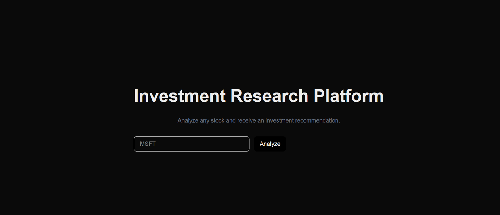
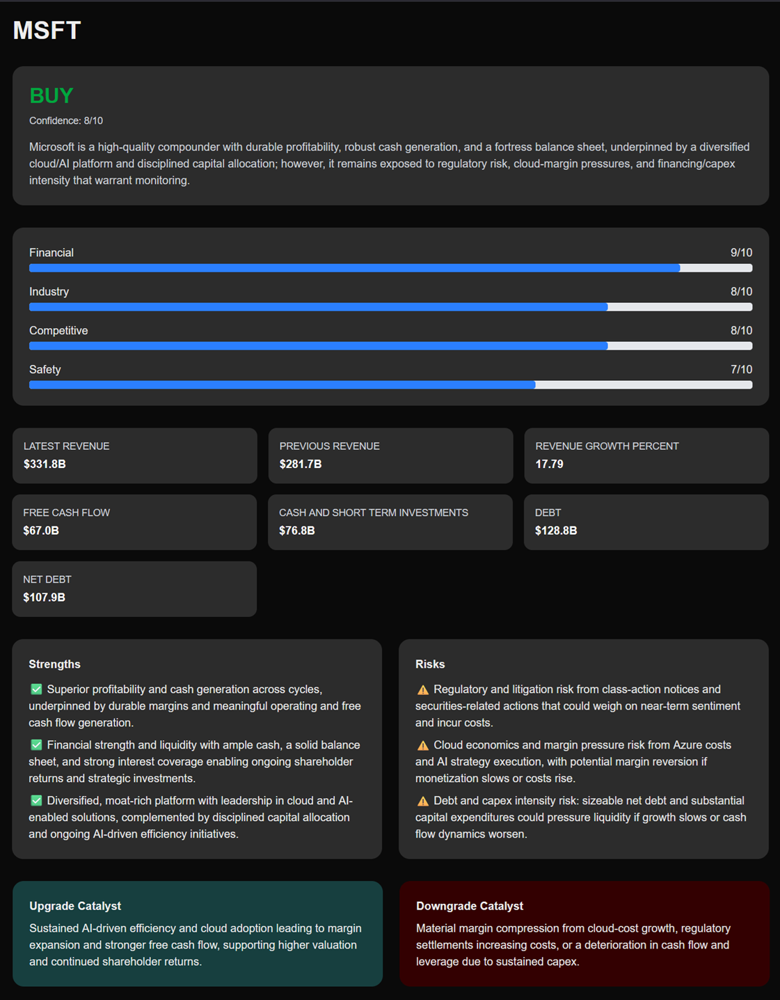

# Investment Research Platform

A full-stack AI-powered investment research platform that analyzes publicly traded companies and produces structured investment recommendations supported by financial, industry, competitive, and risk analysis.





The application combines FastAPI, Next.js, OpenAI, Financial Modeling Prep (FMP), and NewsAPI to automate a workflow similar to that of an equity research analyst.

Unlike generic AI chatbots, the system performs specialized analysis through multiple research agents and generates explainable BUY, WATCHLIST, or SELL recommendations supported by evidence.


## Key Highlights

- Full-stack AI application
- Multi-agent architecture
- Investment research automation
- Structured BUY / WATCHLIST / SELL recommendations
- Real-time financial data integration
- Company news analysis
- Financial statement analysis
- Industry analysis
- Competitive analysis
- Risk assessment
- Investment memo generation
- Explainable investment scoring
- Report archival system
- Dockerized deployment
- Docker Compose orchestration
- Environment-based configuration


## Example Output

```json
{
  "company": "MSFT",
  "rating": "BUY",
  "confidence": 8,
  "financial_score": 9,
  "industry_score": 8,
  "competitive_score": 9,
  "safety_score": 7,
  "thesis": "Microsoft is a high-quality, cash-generative software ...",
  "key_metrics": {
    "latest_revenue": "$331.8B",
    "previous_revenue": "$281.7B",
    "revenue_growth_percent": 17.79,
    "free_cash_flow": "$67.0B",
    "cash_and_short_term_investments": "$76.8B",
    "debt": "$128.8B",
    "net_debt": "$107.9B"
  },
  "strengths": [
    "Exceptional profitability ...",
    "Very strong balance sheet ...",
    "Dominant, diversified ..."
  ],
  "risks": [
    "Litigation/regulatory risk ...",
    "Margin headwinds from ...",
    "Debt/capital-allocation ..."
  ],
  "upgrade_catalyst": "AI-driven efficiency gains ...",
  "downgrade_catalyst": "Material margin compression ...",
  "report_file": "reports\\MSFT_20260808_163540.md"
}
```

## Project Structure
```text
investment-research-platform/
├── frontend/
│   ├── src/
│   │   ├── app/
│   │   │   ├── analyze/
│   │   │   │   └── page.tsx
│   │   │   ├── page.tsx
│   │   │   └── layout.tsx
│   │   ├── components/
│   │   │   ├── MetricsGrid.tsx
│   │   │   ├── RecommendationCard.tsx
│   │   │   ├── ScoreBreakdown.tsx
│   │   │   └── SearchBar.tsx
│   │   └── lib/
│   │       └── api.ts
│   ├── Dockerfile
│   ├── .dockerignore
│   └── package.json
│
├── backend/
│   ├── agents/
│   │   ├── coordinator.py
│   │   ├── financial_agent.py
│   │   ├── industry_agent.py
│   │   ├── competitor_agent.py
│   │   ├── news_agent.py
│   │   ├── risk_agent.py
│   │   └── decision_agent.py
│   │
│   ├── services/
│   │   ├── market_data.py
│   │   ├── news_service.py
│   │   ├── memo_builder.py
│   │   ├── metrics.py
│   │   ├── openai_client.py
│   │   └── report_storage.py
│   │
│   ├── schemas/
│   │   ├── requests.py
│   │   └── responses.py
│   │
│   ├── reports/
│   ├── main.py
│   ├── Dockerfile
│   ├── .dockerignore
│   └── requirements.txt
│
├── docker-compose.yml
└── README.md
```


## Features

### Financial Analysis Agent

Analyzes:
- Income statements
- Balance sheets
- Cash flow statements
- Revenue growth
- Liquidity
- Leverage
- Profitability

### News Analysis Agent

Analyzes:
- Recent company news
- Management developments
- Investor concerns
- Positive and negative catalysts

### Industry Analysis Agent

Analyzes:
- Industry growth
- Competitive landscape
- Market outlook
- Industry risks

### Competitor Analysis Agent

Analyzes:
- Company peers
- Competitive position
- Competitive advantages
- Competitive threats

### Risk Analysis Agent

Analyzes:
- Financial risks
- Regulatory risks
- Industry risks
- Business risks
- Execution risks

### Decision Agent

Synthesizes all evidence and produces:
- Recommendation
- Confidence level
- Investment thesis
- Strengths
- Risks
- Upgrade catalysts
- Downgrade catalysts

## System Architecture

```text
User
 │
 ▼
FastAPI API
 │
 ▼
Coordinator Agent
 │
 ├── Financial Agent
 ├── News Agent
 ├── Industry Agent
 ├── Competitor Agent
 └── Risk Agent
 │
 ▼
Investment Memo Generation
 │
 ▼
Decision Agent
 │
 ▼
Structured Recommendation
```


## Tech Stack

| Component        | Technology                               |
| ---------------- | ---------------------------------------- |
| Front-End        | Next.js, React, TypeScript, Tailwind CSS |
| Back-End         | FastAPI                                  |
| LLM              | OpenAI GPT                               |
| Financial Data   | Financial Modeling Prep (FMP)            |
| News Data        | NewsAPI                                  |
| Language         | Python                                   |
| API Layer        | FastAPI REST APIs                        |
| Containerization | Docker, Docker Compose                   |


## Skills Demonstrated

- Multi-Agent Systems
- AI Orchestration
- Investment Research Automation
- Financial Statement Analysis
- Prompt Engineering
- LLM Application Development
- FastAPI
- Next.js
- TypeScript
- Python
- REST APIs
- Full-Stack Development
- Agent-Based Architecture
- Financial Data Integration
- Explainable AI
- Docker
- Docker Compose
- Containerization
- Environment Configuration


## Getting Started
### 1. Clone the Repository

```bash
git clone https://github.com/meysamrezaee/investment-research-platform.git
cd investment-research-platform
```

### 2. Create Environment Files

#### Option 1: Copy the Example Files, and then fill API keys

```bash
cp backend/.env.example backend/.env
cp frontend/.env.local.example frontend/.env.local
```

#### Option 2: Create Them Manually

backend/.env
```text
OPENAI_API_KEY=...
FMP_API_KEY=...
NEWS_API_KEY=...
FRONTEND_URL=http://localhost:3000
```

frontend/.env.local
```text
NEXT_PUBLIC_BACKEND_URL=http://localhost:8000
```

### Option A: Run with Docker (Recommended)
Prerequisites:
- Docker Desktop

Build and Start
```
docker compose up --build
```

Application URLs

Frontend:
http://localhost:3000

Backend:
http://localhost:8000

Swagger API Documentation:
http://localhost:8000/docs

When you are done, stop the Application:
```
docker compose down
```


### Option B: Run Locally Without Docker

### Set up the Back-End (Python + FastAPI)

Navigate to the backend directory and create a virtual environment:
```bash
cd backend
python -m venv .venv
```
Activate the virtual environment:

**Windows**
```bash
.venv\Scripts\activate
```

**Linux / macOS**
```bash
source .venv/bin/activate
```

Install dependencies:

```bash
pip install -r requirements.txt
```


Run:
```bash
uvicorn main:app --reload
```

Back-end runs at:

```text
http://localhost:8000
```


Swagger API documentation:
```text
http://localhost:8000/docs
```


### Set Up the Front-End (Next.js)

```bash
cd frontend
npm install
npm run dev
```

Front-end runs at:

```text
http://localhost:3000
```

## Current Endpoint

Research Endpoint
```text
POST /research
```

Example:
```json
{
  "company": "MSFT"
}
```

Response:
```json
{
  "company": "MSFT",
  "rating": "BUY",
  "confidence": 8
}
```


## Future Enhancements

- SEC filing integration
- Historical recommendation tracking
- Portfolio watchlists
- Recommendation backtesting


## Disclaimer

This application was developed as a software engineering and AI portfolio project to demonstrate multi-agent systems, investment research automation, financial data integration, and LLM-powered decision support.

It is not intended to provide financial advice, investment recommendations, or portfolio management services.

Users should conduct their own due diligence and consult qualified financial professionals before making investment decisions.


## License

This project is licensed under the MIT License. See the LICENSE file for details.


## Credits
Created by Meysam Rezaee
